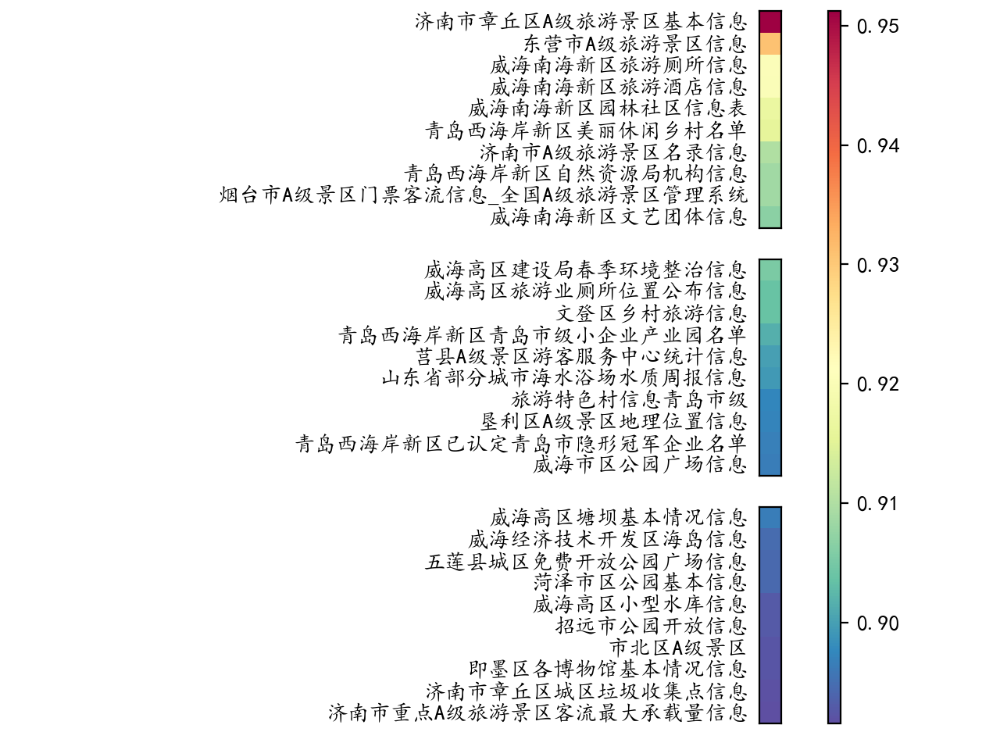

### 关于词向量模型
- sgns.target.word-word.dynwin5.thr10.neg5.dim300.iter5.bz2是小型预训练未微调模型

- tencent-ailab-embedding-zh-d100-v0.2.0-s/tencent-ailab-embedding-zh-d100-v0.2.0-s.txt 是100维预训练小词向量模型

- tencent-ailab-embedding-zh-d100-v0.2.0/tencent-ailab-embedding-zh-d100-v0.2.0.txt 是100维预训练大词向量模型

词向量模型下载可以参考腾讯AI实验室：https://ai.tencent.com/ailab/nlp/en/embedding.html, 下载的模型需要解压至同级文件夹下，保证model_path读取正确

### 测试用例
基于Flask展开，配置环境依赖包见[requirements.txt](requirements.txt)，详细开发环境细节见[newsRec.yml](newsRec.yml)

### 可视化结果
- 用户浏览条目：【青岛西海岸新区天气情况，青岛市5A级旅游景点开放情况】
- 结果：

### 开发版本
早期开发版本详见origin文件夹，外部文件夹为嵌入原型系统版本
